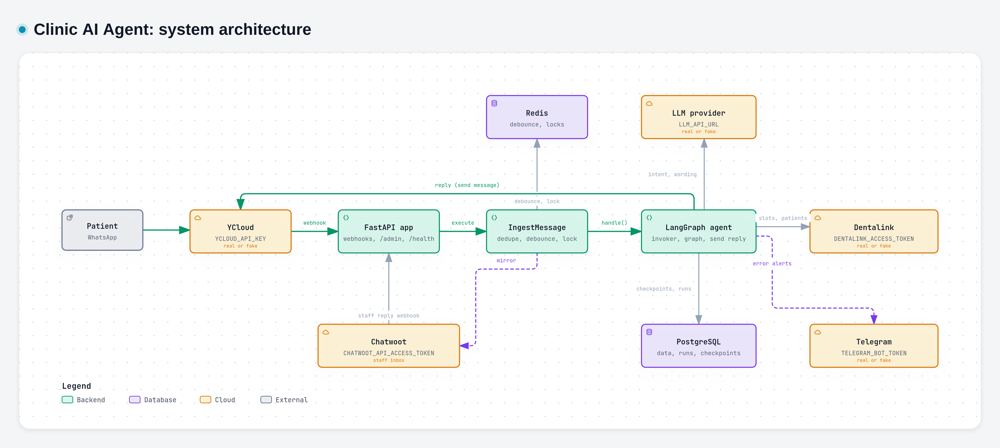
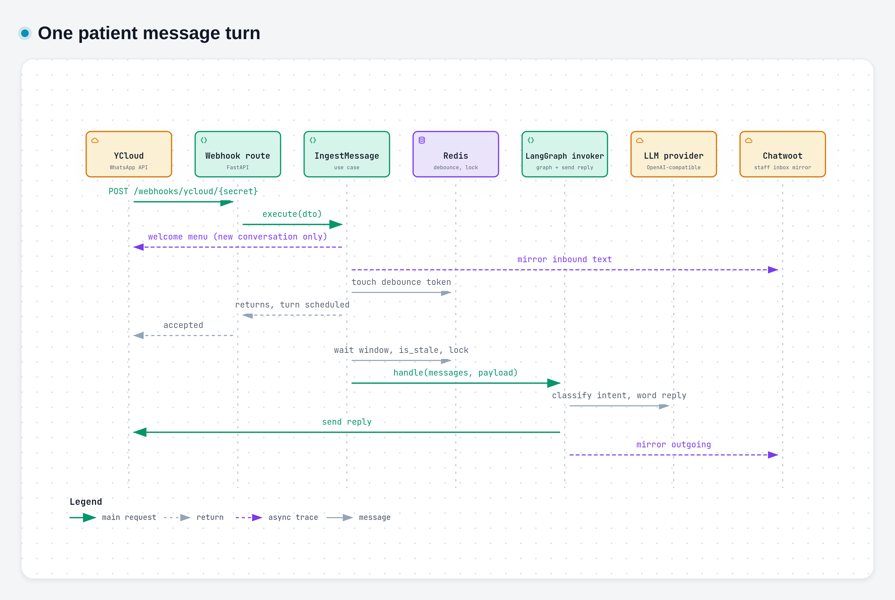
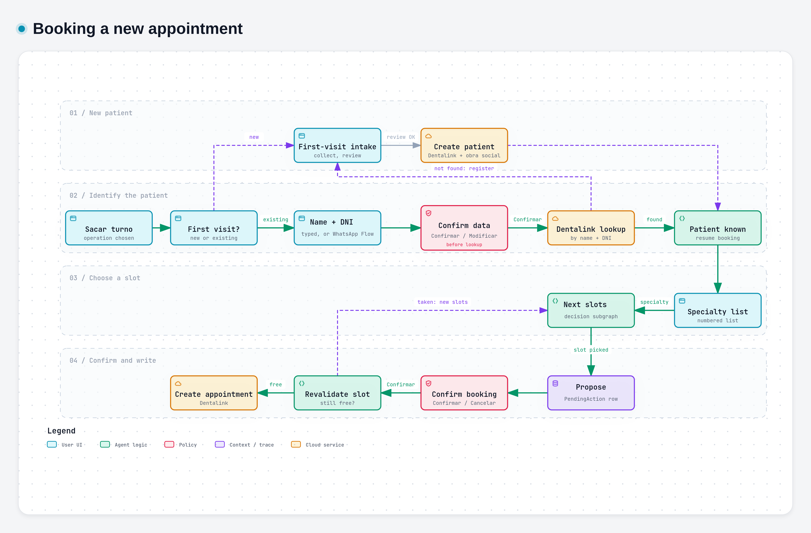
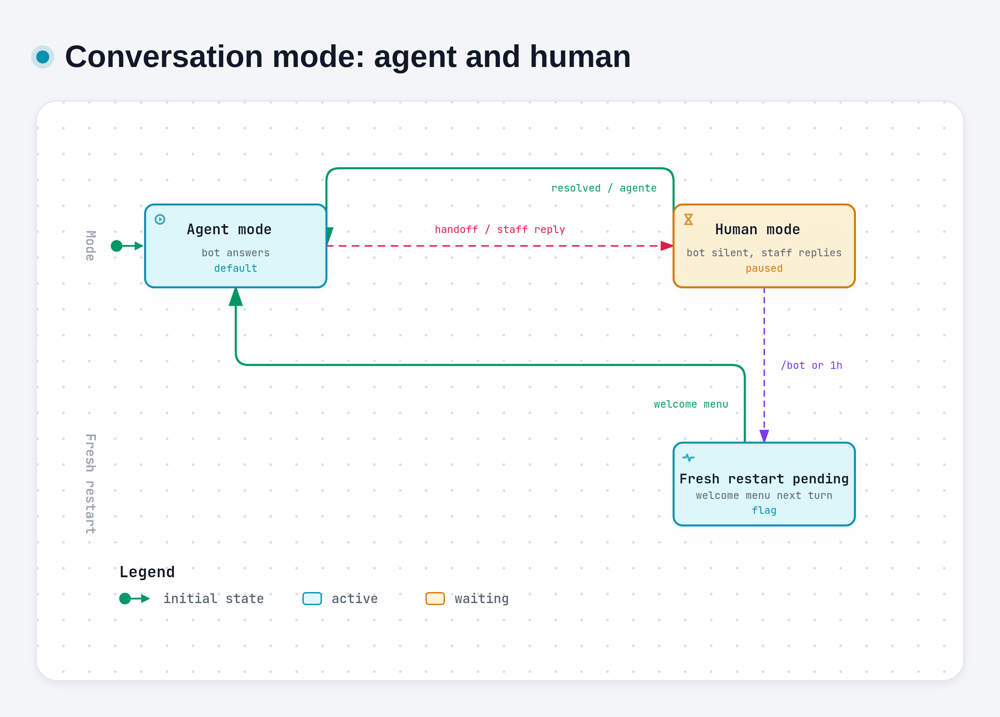

# Clinic AI Agent

WhatsApp assistant for a dental clinic. Patients write to the clinic's WhatsApp
number (through YCloud); a LangGraph agent books, reschedules and cancels
appointments in Dentalink, answers clinic questions, and hands the conversation
to a human when needed. Staff follow every conversation in a Chatwoot inbox that
mirrors the chat. Patient-facing wording is Spanish (es_AR), times use the
Argentina timezone.

Stack: Python 3.11, FastAPI, LangGraph, PostgreSQL, Redis, managed with `uv`.
Hexagonal layout: `api -> agent / application -> domain`, with infrastructure
adapters implementing the domain Protocols.

## Architecture

Click an image to open the interactive diagram (zoom, focus, export).

[](docs/diagrams/system-architecture.html)

PostgreSQL and Redis are always real. Every other adapter is real only when its
setting is non-empty; otherwise an in-memory fake is injected (see
`app/api/dependencies/gateways.py`).

| Adapter | Switch (setting name) | Real implementation | Fake when unset |
|---|---|---|---|
| WhatsApp messaging and handoff | `YCLOUD_API_KEY` | YCloud (`app/infrastructure/ycloud`) | yes |
| Dentalink (appointments, patients, agreements, specialties, treatments, reminders) | `DENTALINK_ACCESS_TOKEN` | Dentalink REST (`app/infrastructure/dentalink`) | yes |
| LLM | `LLM_API_URL` (+ `OPENROUTER_API_KEY` or `LLM_API_KEY`, `LLM_MODEL` or `OPENAI_MODEL`) | OpenAI-compatible endpoint (`app/infrastructure/llm`) | yes |
| Chatwoot staff inbox | `CHATWOOT_API_ACCESS_TOKEN` | Chatwoot API (`app/infrastructure/chatwoot`) | yes |
| Telegram error alerts | `TELEGRAM_BOT_TOKEN` | Telegram Bot API (`app/infrastructure/telegram`) | yes |
| Groq transcription | `GROQ_API_KEY` | Groq (`app/infrastructure/transcription`) | yes, but see below |
| YCloud media gateway, media downloader | none | not wired | always fake |
| Linear incident gateway | none | not wired | always fake |

Audio is not functional end to end: an audio message creates a media job, but the
job processor (`app/workers/audio_tasks.py`) is not scheduled anywhere, and the
media gateway and downloader are always fakes.

The agent is the real `LangGraphAgentInvoker`. `NotImplementedAgentInvoker` is a
leftover file and is not wired.

### One message turn

[](docs/diagrams/message-turn.html)

The webhook request runs the synchronous part (dedupe, persist, human-mode gate,
welcome menu for a new conversation, debounce touch). The debounce wait, the
per-conversation Redis lock and the agent run happen in a background task. Button
taps skip the debounce wait. A conversation in human mode is persisted but never
reaches the agent.

### Agent graph

`app/agent/graph.py`:

```text
START -> check_conversation_mode -> END                (human mode: silent)
                                 -> fresh_restart -> END
                                 -> resolve_interaction -> END  (thanks, post-action close,
                                      |                          third-party guard, handoff declined)
                                      |-- appointment (-> handoff when the flow is stuck)
                                      |-- agreement (insurance)   |-- specialties
                                      |-- handoff                 |-- question
                                      |-- location                |-- faq_topic
                                      |-- payment_admin           |-- reminder_action (-> appointment)
                                      `-- fallback
any node error -> handle_error -> END
```

Menu button payloads are mapped deterministically before the LLM classifies
free text. Conversation state is checkpointed in PostgreSQL (`AsyncPostgresSaver`
on its own psycopg pool); the thread id is `{conversation_id}:session:{generation}`.
`search_availability` exists as a demo node and is not wired into the graph.

### Booking flow

[](docs/diagrams/booking-flow.html)

Creating an appointment: the patient picks the operation, answers whether it is
their first visit, and an existing patient is identified by name and DNI. The
typed data is echoed with Confirmar / Modificar before any Dentalink lookup. A
patient who is not found can register (first-visit intake, then creation in
Dentalink), retry, or talk to an advisor. Once the patient is known, the agent
offers specialties, shows the next slots, and proposes the chosen slot as a
`PendingAction`; only the Confirmar / Cancelar buttons settle it, and the slot is
revalidated against Dentalink right before the write. A patient already
remembered in the conversation skips identification. Reschedule and cancel
identify the patient first, then list their appointments.

### Conversation modes

[](docs/diagrams/conversation-mode.html)

- Handoff, a Chatwoot staff reply, or the Chatwoot `administracion` label switch
  the conversation to human mode; the bot stays silent.
- A staff message typed in the WhatsApp Business app resets a 1 hour clock. The
  next patient message after more than 1 hour reactivates the bot (lazy check, no
  scheduler); a handoff nobody answered waits indefinitely.
- `/bot` sent from the WhatsApp Business app reactivates immediately. Both
  `/bot` and the timeout start a fresh session: the next turn renders the welcome
  menu.
- Resolving the conversation in Chatwoot, or applying the `agente` label, returns
  to agent mode without the welcome-menu restart.

## Repository layout

| Path | Contents |
|---|---|
| `app/api` | FastAPI routes (webhooks, admin, health, internal eval) and dependency wiring (`dependencies/`) |
| `app/agent` | LangGraph graph, nodes, appointment decision subgraph, first-visit intake subgraph |
| `app/application` | Use cases by sub-domain (messages, appointments, conversations, reminders, memory, errors) |
| `app/domain` | Entities, repository and gateway Protocols, value objects |
| `app/infrastructure` | Adapters: database, ycloud, dentalink, llm, chatwoot, redis, telegram, linear, transcription, media |
| `app/workers` | Follow-up worker (includes idle cleanup), appointment reminder worker, unscheduled audio/incident/memory tasks |
| `app/config` | pydantic-settings `Settings` |
| `migrations` | Alembic migrations |
| `evals` | promptfoo conversation evals |
| `tests` | Unit and integration tests |
| `docs` | Design notes, runbooks, diagrams (`docs/diagrams`, `docs/assets`) |

`app/main.py` starts the follow-up worker always, and the reminder worker only
when reminders are enabled and the recipient policy allows it. `/docs`, `/redoc`
and `/openapi.json` are disabled and re-exposed behind the admin session under
`/admin/docs`, `/admin/redoc` and `/admin/openapi.json`.

## Setup

Requirements: Python 3.11+, [`uv`](https://docs.astral.sh/uv/), Docker with
Compose (for PostgreSQL and Redis).

```bash
uv sync --frozen --extra dev
cp dotenv_example_template.txt .env
docker compose up -d postgres redis
uv run python -m alembic upgrade head
```

`dotenv_example_template.txt` documents the discrete `APP_*`, `POSTGRES_*`,
`REDIS_*`, `YCLOUD_*` and `CHATWOOT_*` settings. `DATABASE_URL` and `REDIS_URL`
are derived from them by `app.config.settings`. The template does not list every
setting: `LLM_API_URL`, the LLM key and model, `GROQ_API_KEY`,
`ADMIN_SESSION_SECRET`, `INTERNAL_EVAL_ENABLED`, `YCLOUD_VERIFICATION_FLOW_ID`,
`YCLOUD_REGISTRATION_FLOW_ID` and others are read from `app/config/settings.py`.
Settings load from `.env` and `/run/secrets/backend.env`. With no credentials set,
the app runs entirely on fakes.

## Run

```bash
uv run python -m app.main          # uses APP_HOST / APP_PORT
uv run uvicorn app.main:app --reload
```

`GET /health` is liveness (no dependency checks); `GET /ready` checks PostgreSQL
and Redis. Run a single worker process: the debounce accumulator lives in process
memory, and `docker-stack.yml` uses one replica.

## Test, lint, typecheck

The same commands CI runs (`.github/workflows/ci.yml`):

```bash
uv run ruff check .
uv run mypy app/
uv run pytest
```

## Docker and deploy

The multi-stage `Dockerfile` builds with `uv sync --frozen --no-dev`, runs as a
non-root user and exposes port 8000. `entrypoint.sh` runs
`alembic upgrade head` before starting uvicorn. `docker-compose.yml` provides
PostgreSQL 16 and Redis 7 for local work. Production runs as a Docker Swarm stack
(`docker-stack.yml`, one replica, settings injected as the
`agente_ai_backend_env` secret) from the image `ghcr.io/fer336/agente-ai`.

## Evals

promptfoo drives `POST /internal/eval/chat` (the real graph with fake Dentalink
and YCloud), enabled only with `INTERNAL_EVAL_ENABLED` and an admin session:

```bash
npx promptfoo@0.124.0 eval -c evals/promptfooconfig.yaml --no-cache
```

Datasets are in `evals/datasets`; see [evals/README.md](evals/README.md) for the
full setup and `evals/run-audit.sh` for production audits.

## Release workflow

Squash-merged PR titles drive releases: `feat` bumps minor, `fix` and `perf` bump
patch, `!` or a `BREAKING CHANGE` bumps major, and `chore`, `docs`, `refactor`
and `test` publish nothing. The workflows `auto-tag.yml`, `release.yml` and a
`chore(release): pin backend image` commit take it from there. Details in
[docs/pr-release-workflow.md](docs/pr-release-workflow.md).

## Connect Chatwoot

YCloud stays the patient-facing channel and source of truth; Chatwoot is the
staff inbox. It receives copies of patient and bot messages, forwards staff
replies back through YCloud, and controls handoff with conversation labels.

1. Create or select a Chatwoot inbox and attach an Agent Bot.
2. Create the labels `agente` and `administracion` in the Chatwoot account.
3. Set every `CHATWOOT_*` value documented in `dotenv_example_template.txt`: a
   personal admin/agent API token for contact, conversation and label
   operations, and the separate Agent Bot token for bot-authored messages.
4. Create an account-level Chatwoot webhook for `message_created`,
   `conversation_updated` and `conversation_status_changed`, targeting
   `https://<public-agent-host>/webhooks/chatwoot/<CHATWOOT_WEBHOOK_SECRET>`.
5. Run `uv run python -m alembic upgrade head` so the Chatwoot mapping table exists, then
   restart the application.

Any public staff reply pauses the bot and synchronizes the `administracion`
label before the message is forwarded to WhatsApp. Keep the webhook behind HTTPS:
the route authenticates with the path secret only and does not verify
`X-Chatwoot-Signature`.

## Appointment-reminder rollout

Reminders are fail-closed: disabled by default (`APPOINTMENT_REMINDERS_ENABLED`),
and the safe default `APPOINTMENT_REMINDERS_ROLLOUT_MODE=allowlist` requires an
E.164 allowlist. An empty allowlist blocks sends only in `allowlist` mode; it never
implies `all`. `all` is the explicit production mode and still requires
`APPOINTMENT_REMINDERS_ENABLED=true`. Follow the
[staged rollout runbook](docs/appointment-reminders-runbook.md) before any manual
production enablement. Changing the mode needs an application restart.

## Idle conversation cleanup

After `CONVERSATION_IDLE_RESET_DELAY_SECONDS` of total silence (default `10800`,
3 hours) the follow-up worker wipes the agent's working memory for that one
conversation, so the next message starts a fresh session with the welcome menu.

- Wiped: LangGraph checkpoints of every session generation, the contact's
  compacted memory (`contact_memories` and its Redis cache), and the
  conversation's pending and scheduled actions (marked expired or cancelled, not
  deleted).
- Kept: messages, agent runs, errors, incidents, contacts, conversations, Chatwoot
  mappings, handoffs, outbox and sent messages.
- Skipped: conversations in human mode keep their context.
- Failures are logged without patient data and never break the worker tick.

## Documentation

| File | What it is |
|---|---|
| [PRD.md](PRD.md) | Product requirements (Spanish). Describes intent: verify against the code before relying on it. |
| [docs/architecture.md](docs/architecture.md) | Early design write-up. Partly outdated (it predates the real adapters and the current booking order); the diagrams above and the code are authoritative. |
| [docs/CONVERSATIONAL_AGENT_V2.md](docs/CONVERSATIONAL_AGENT_V2.md) | Design and plan for the conversational agent. Intent, not a description of the current code. |
| [docs/pr-release-workflow.md](docs/pr-release-workflow.md) | Branching, commits, CI, PR template and release pipeline. |
| [docs/appointment-reminders-runbook.md](docs/appointment-reminders-runbook.md) | Staged rollout and operation of appointment reminders. |
| [evals/README.md](evals/README.md) | promptfoo eval setup and audits. |
| [docs/diagrams](docs/diagrams) | Interactive diagrams and their typed JSON sources. |

## Credits

Diagrams generated with [Archify](https://github.com/tt-a1i/archify) (MIT).
